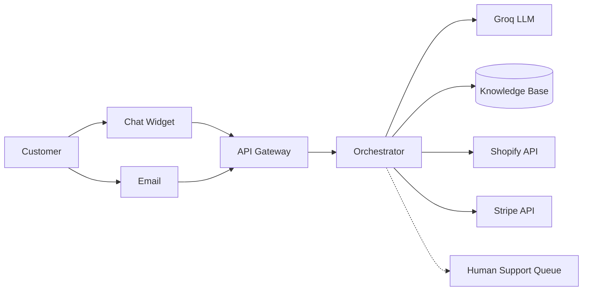

# CSAutopilot
Here is a complete `README.md` for your **Customer Support Autopilot (CSA)** project.

```markdown
# 🤖 Customer Support Autopilot (CSA)

[](https://groq.com)
[](https://fastapi.tiangolo.com)
[](https://nextjs.org)
[](https://opensource.org/licenses/MIT)

**Orchestrate your knowledge base + order history + Groq LLM** – automatically resolve **70% of customer support tickets** (refunds, FAQs, order status) in real time via chat widget or email.

> 🚀 Built for SaaS & e‑commerce teams tired of expensive, slow, and bloated helpdesks. Uses Groq’s LPU for **500+ tokens/sec** at **3–18x lower cost** than GPT‑5.

---

## ✨ Key Features

- 🧠 **Intent Classification & RAG** – Understands refunds, order status, shipping, FAQs, and account issues.
- ⚡ **Blazing Fast** – Groq LPU delivers sub‑0.5s first token, 500+ tokens/sec streaming.
- 🔌 **Plug‑and‑Play Integrations** – Shopify, WooCommerce, Stripe, Zendesk (read/write tickets).
- 💬 **Chat Widget + Email** – Embed a single `<script>` or forward emails to `support@yourapp.com`.
- 📊 **Human Escalation** – Routes complex queries to your existing helpdesk with full conversation context.
- 💰 **Outcome‑Based Pricing** – Pay only per automated resolution (not per seat or API call).

---

## 🧱 Architecture Overview



**Tech Stack**:
- **Backend**: FastAPI (async) + LangGraph (agentic workflows)
- **LLM**: Groq (Llama 3.3 70B, Mixtral 8x7B)
- **Vector DB**: Pinecone / Qdrant (for KB search)
- **Frontend**: Next.js 15 + Vercel AI SDK (streaming chat)
- **Infra**: Docker Compose + optional Kubernetes / Terraform

---

## 📦 Prerequisites

- Python 3.11+
- Node.js 20+ & npm
- Docker & Docker Compose (recommended)
- Groq API key – [get one for free](https://console.groq.com)
- Shopify app (for order/refund access) – [create a private app](https://help.shopify.com/en/manual/apps/private-apps)
- Stripe secret key (if processing refunds via AI)
- (Optional) Pinecone API key for vector search

---

## 🚀 Quick Start (Docker)

```bash
# 1. Clone the repository
git clone https://github.com/your-username/customer-support-autopilot.git
cd customer-support-autopilot

# 2. Copy environment variables
cp .env.example .env

# 3. Edit .env – add your Groq, Shopify, Stripe keys
nano .env

# 4. Start everything (backend + frontend + integrations)
docker compose up -d

# 5. Seed your knowledge base (FAQs, help docs)
docker compose exec backend python scripts/seed_kb.py --kb ./docs/faq.md

# 6. Open the chat widget demo
open http://localhost:3000
```

The API will be available at `http://localhost:8000` and the chat widget at `http://localhost:3000`.

---

## 🛠️ Manual Installation (without Docker)

### Backend (FastAPI)
```bash
cd backend
python -m venv venv
source venv/bin/activate   # or `venv\Scripts\activate` on Windows
pip install -r requirements.txt

# Run migrations (if using PostgreSQL for logs)
alembic upgrade head

# Start the server
uvicorn app.main:app --reload --port 8000
```

### Frontend (Next.js)
```bash
cd frontend
npm install
npm run dev
```

### Environment Variables (.env)
```ini
# Groq
GROQ_API_KEY=your_groq_key
GROQ_MODEL=llama-3.3-70b-versatile

# Shopify
SHOPIFY_STORE_URL=your-store.myshopify.com
SHOPIFY_ACCESS_TOKEN=shpat_xxxx

# Stripe
STRIPE_SECRET_KEY=sk_live_xxxx
STRIPE_WEBHOOK_SECRET=whsec_xxxx

# Vector DB (optional)
PINECONE_API_KEY=xxxx
PINECONE_INDEX=kb-index

# Helpdesk integration (optional)
ZENDESK_SUBDOMAIN=your-subdomain
ZENDESK_EMAIL=admin@example.com
ZENDESK_API_TOKEN=xxxx

# Internal
SECRET_KEY=your-strong-secret
REDIS_URL=redis://localhost:6379
```

---

## 🧪 Testing the API

```bash
# Chat endpoint (streaming)
curl -X POST http://localhost:8000/api/chat \
  -H "Content-Type: application/json" \
  -d '{"message":"Where is my order #1234?", "session_id":"test-user"}'

# Email webhook (simulate incoming email)
curl -X POST http://localhost:8000/api/email \
  -H "Content-Type: application/json" \
  -d '{"from":"customer@example.com","subject":"Refund for order 1234","body":"..."}'
```

---

## 💬 Embedding the Chat Widget

Add this snippet to any HTML page (Shopify, WordPress, custom site):

```html
<script src="https://your-domain.com/widget.js" defer></script>
<div id="csa-widget" data-brand="Your Store" data-primary="#4F46E5"></div>
```

The widget will automatically appear as a chat bubble. All conversations are routed through your CSA backend.

---

## 📈 Monitoring & Analytics

- **Resolution Rate** – Dashboard shows % of tickets auto‑resolved.
- **Cost per Resolution** – based on Groq token usage.
- **Fallback Reasons** – why the AI escalated (e.g., “sentiment too negative”, “missing order data”).
- **CSAT** – collected via post‑chat thumbs up/down.

Access the merchant dashboard at `http://localhost:3000/dashboard` (demo credentials: `admin@example.com` / `demo123`).

---

## 🚢 Deployment to Production

### Option 1: Railway / Render (easiest)
- Backend: `cd backend && gunicorn app.main:app -k uvicorn.workers.UvicornWorker`
- Frontend: `npm run build && npm start`
- Add environment variables in the platform UI.

### Option 2: Kubernetes (scalable)
```bash
cd infrastructure/kubernetes
kubectl apply -f namespace.yaml
kubectl apply -f deployment.yaml
kubectl apply -f service.yaml
```

### Option 3: Terraform (AWS/GCP)
```bash
cd infrastructure/terraform
terraform init
terraform apply -var="groq_api_key=..."
```

---

## 🧩 Extending with New Tools

Add a custom tool (e.g., `get_shipping_status`) by editing `backend/app/tools/`:

```python
# backend/app/tools/shipping.py
async def get_shipping_status(order_id: str) -> str:
    # call your carrier API
    return "Shipped on 2025-05-20, expected delivery May 22"

# Then register it in orchestrator.py
tools = [get_order_status, process_refund, search_kb, get_shipping_status]
```

The LLM will automatically decide when to invoke the new tool based on the user’s query.

---

## 🤝 Contributing

We welcome contributions!

1. Fork the repo
2. Create a feature branch: `git checkout -b feat/amazing-feature`
3. Run linting: `make lint` (ruff, prettier)
4. Run tests: `make test`
5. Submit a PR with a clear description

Please read [CONTRIBUTING.md](CONTRIBUTING.md) for code of conduct and detailed guidelines.

---

## 📄 License

Distributed under the MIT License. See `LICENSE` for more information.

---

## 🙏 Acknowledgements

- [Groq](https://groq.com) for the fastest LLM inference on Earth
- [LangChain](https://langchain.com) & [LangGraph](https://langchain-ai.github.io/langgraph/)
- [Vercel AI SDK](https://sdk.vercel.ai/docs)
- All open‑source contributors

---

## 📬 Contact & Support

- **Issues**: [GitHub Issues](https://github.com/your-username/customer-support-autopilot/issues)
- **Discord**: [Join our community](https://discord.gg/example)
- **Email**: support@csautopilot.com

```

You can save this as `README.md` in the project root. It covers everything from first-time setup to production deployment and even includes a sample widget embed code.
